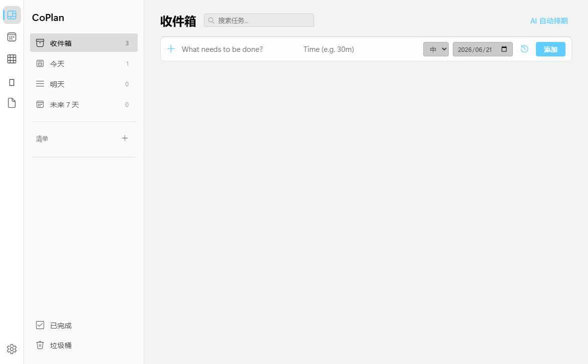
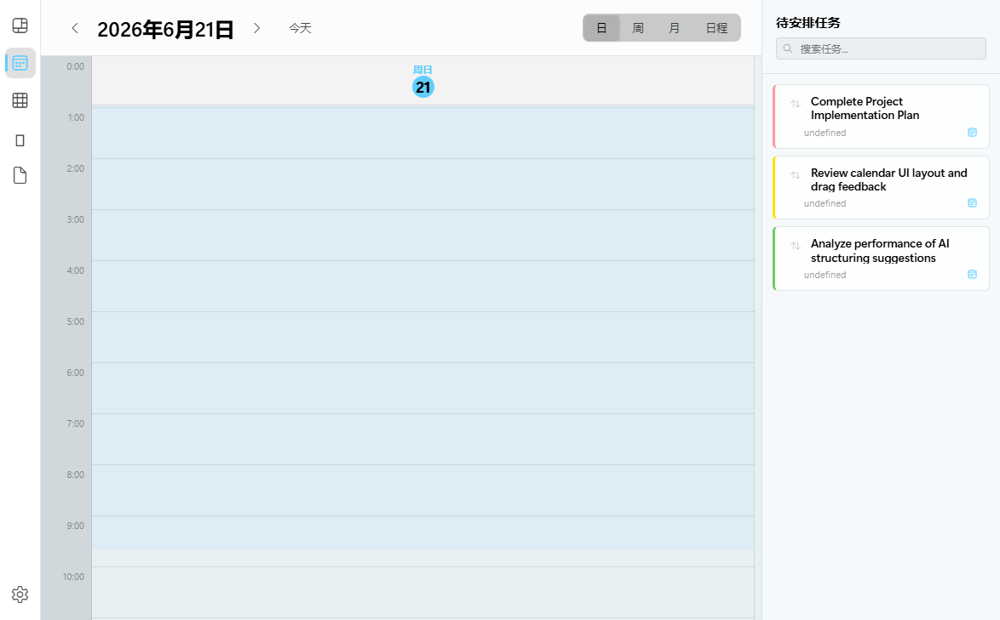
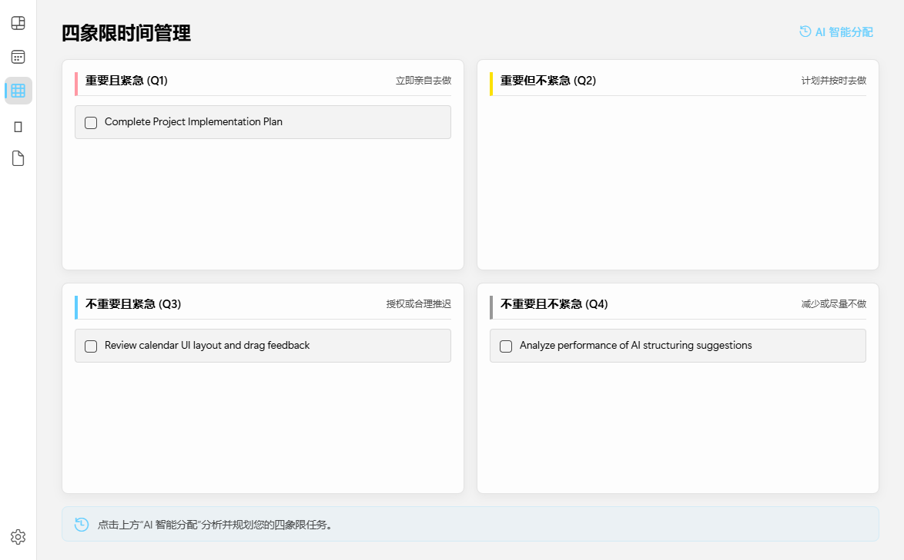
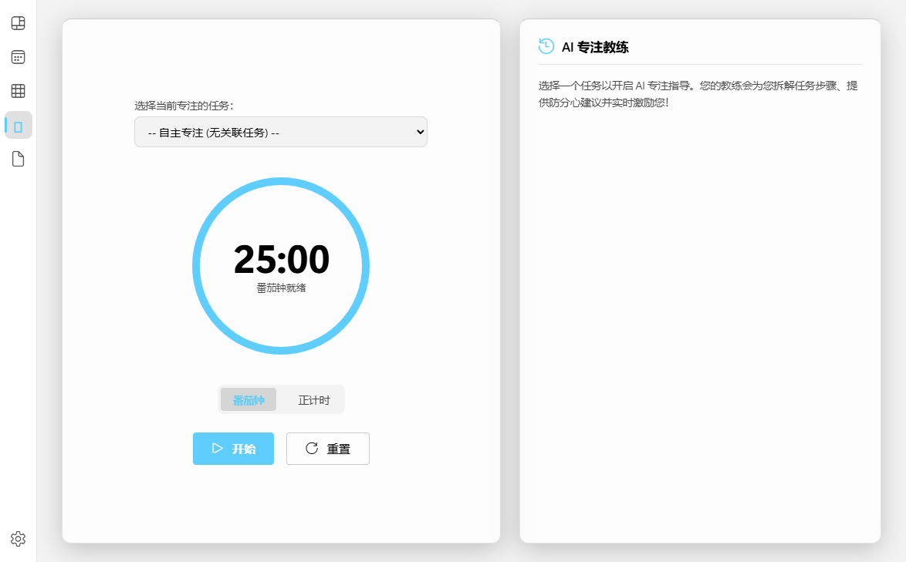
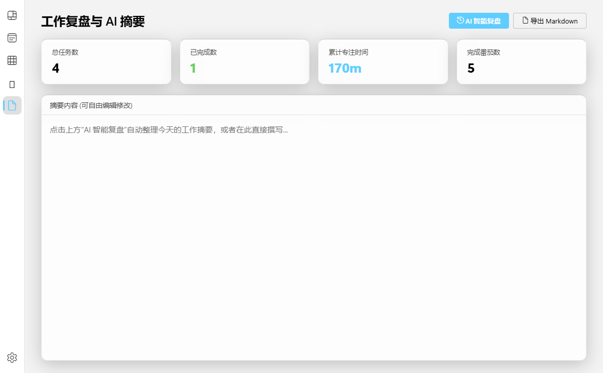

# CoPlan

<p align="center">
  
  
  
  
</p>

<p align="center">
  <b>CoPlan — AI 时间计划管理大师</b><br>
  <b>CoPlan — AI-Powered Time & Task Manager</b><br>
  一款跨平台桌面级任务与日历管理工具，集成 AI 智能排期，让时间管理真正自动化。<br>
  A cross-platform desktop task and calendar management tool with AI-powered scheduling.
</p>

---

## 核心功能 / Core Features

### AI 智能排期 / AI Smart Scheduling
连接任意 OpenAI 兼容 API 或 Google Gemini，一键自动为任务安排最佳时间：
- **AI 自动排期** — 根据任务优先级、预估时长、工作时间和截止日期，智能安排日程
- **AI 解析任务** — 输入自然语言描述（如 "明天下午 3 点开会 2 小时"），AI 自动解析并创建任务
- 支持自定义 API Base URL、模型名称和密钥

### 四象限时间管理 (Eisenhower Matrix) / Eisenhower Quadrants
- **2x2 艾森豪威尔法则网格** — 自动或通过拖拽将任务分配到重要性/紧急性维度
- **拖拽与属性联动** — 拖拽任务至不同象限可自动修改其优先级、到期时间，实现高效整理
- **AI 智能分配与分析** — 一键评估所有任务，生成象限分配方案、AI 推荐理由和结构优化建议

### 专注时钟 (Stopwatch & Pomodoro) / Focus Timer
- **番茄钟与正计时** — 提供标准 25 分钟工作/5 分钟休息自动循环或正向累计计时
- **任务绑定时间追踪** — 选择特定待办任务进行计时，自动累加和保存专注时长至任务记录
- **Web Audio 蜂鸣音提醒** — 番茄钟结束时，使用 Web Audio API 合成音频铃声提示
- **AI 专注教练** — 依据任务特性生成定制化格言、执行拆解步骤和防干扰贴士

### 工作复盘与 AI 摘要 (Summary) / Daily Review & AI Summary
- **统计看板指标** — 汇总今日已完成任务数、未完成数、累计专注分钟、完成番茄钟个数
- **AI 智能复盘报告** — 汇总分析今日已完成及未完成任务，智能生成今日工作综述、时间投入诊断、成果亮点与行动建议
- **导出 Markdown** — 支持一键将生成的复盘报告以 Markdown 格式导出并下载至本地

### 任务管理 / Task Management
- **智能列表** — 收件箱、今天、明天、未来 7 天、已完成、垃圾桶
- **自定义清单** — 创建无限数量的自定义列表，支持颜色标记
- **任务属性** — 优先级（高/中/低）、预估时长、截止日期、开始时间
- **拖拽排序** — 直观的任务排序操作
- **实时搜索** — 快速定位任意任务

### 日历视图 / Calendar View
- **四种视图模式** — 日视图、周视图、月视图、日程列表
- **时间线渲染** — 直观显示任务在工作时段中的分布
- **日历中创建任务** — 直接在日历上点击创建新任务

### 个性化体验 / Personalization
- **深色 / 浅色 / 跟随系统** — 三种主题无缝切换
- **中英文双语** — 完整的国际化支持
- **自定义工作时间** — 灵活配置个人工作时段（支持多段，如午休分割）
- **Fluent 设计语言** — 现代 Windows 风格 UI，Acrylic 玻璃质感

### 隐私优先 / Privacy First
- **纯本地存储** — 所有任务数据保存于本地 JSON 文件，不上传任何服务器
- **API 密钥本地保存** — AI 配置仅存储于本地用户目录
- **无注册、无云端** — 打开即用，数据完全属于你自己

---

## 界面预览 / Screenshots

<p align="center">
  
</p>
<p align="center"><i>任务视图 / Task View</i></p>

<p align="center">
  
</p>
<p align="center"><i>日历视图 / Calendar View</i></p>

<p align="center">
  
</p>
<p align="center"><i>四象限时间管理 / Eisenhower Quadrants</i></p>

<p align="center">
  
</p>
<p align="center"><i>专注时钟 / Focus Timer</i></p>

<p align="center">
  
</p>
<p align="center"><i>工作复盘与 AI 摘要 / Daily Review & AI Summary</i></p>

---

## 快速开始 / Quick Start

### 环境要求 / Requirements
- [Node.js](https://nodejs.org/) >= 18
- npm 或 yarn

### 安装运行 / Installation

```bash
# 克隆仓库
git clone https://github.com/tututommy/CoPlan.git
cd CoPlan

# 安装依赖
npm install

# 启动应用
npm start
```

### 配置 AI（可选）/ AI Configuration (Optional)

1. 点击左下角 **设置**（齿轮图标）
2. 填入你的 API 信息：
   - **API 接口地址** — 支持 OpenAI 兼容端点（如 `https://api.openai.com/v1/chat/completions`）或 Google Gemini 端点
   - **模型名称** — 如 `gpt-4o`、`gpt-3.5-turbo`（仅 OpenAI 兼容端点需要）
   - **API 密钥** — 你的个人 API Key
3. 保存后即可使用 AI 自动排期和解析功能

> **推荐模型**：任何支持对话补全的模型均可，如 GPT-4o、Claude、Gemini、DeepSeek、Qwen 等。

---

## 项目结构 / Project Structure

```
CoPlan/
├── main.js           # Electron 主进程 — 本地存储、AI API 桥接
├── preload.js        # 安全 IPC 预加载脚本
├── renderer.js       # 渲染进程 — 完整 UI 逻辑与状态管理
├── index.html        # 应用界面骨架
├── styles.css        # Fluent Design 风格样式
├── package.json      # 项目配置
└── LICENSE           # MIT 许可证
```

---

## 技术栈 / Tech Stack

| 技术 / Technology | 说明 / Description |
|-------------------|-------------------|
| **Electron** | 跨平台桌面应用框架 |
| **原生 HTML/CSS/JS** | 无框架依赖，轻量直接 |
| **Fluent Design** | 微软设计语言，Acrylic 玻璃质感 |
| **本地 JSON 存储** | 无需数据库，零配置 |

---

## 开发计划 / Roadmap

- [x] 任务 CRUD 管理
- [x] 自定义清单与颜色标记
- [x] 日历日/周/月/日程视图
- [x] AI 自动排期（OpenAI 兼容 + Gemini）
- [x] AI 自然语言解析任务
- [x] 深色/浅色/跟随系统主题
- [x] 中英文国际化
- [x] 自定义工作时间
- [x] 任务搜索与拖拽排序
- [x] 番茄钟专注模式
- [x] 数据导出/导入（Markdown格式）
- [x] 打包发布（Windows / macOS / Linux 安装包）
- [ ] 重复任务规则
- [ ] 任务标签系统
- [ ] 系统托盘与快捷键

---

## 贡献指南 / Contributing

欢迎提交 Issue 和 PR！

1. Fork 本仓库
2. 创建功能分支：`git checkout -b feature/新功能`
3. 提交更改：`git commit -m '添加: 新功能'`
4. 推送分支：`git push origin feature/新功能`
5. 发起 Pull Request

---

## 许可证 / License

本项目基于 [MIT License](LICENSE) 开源。你可以自由使用、修改和分发。

---

<p align="center">
  Made by <a href="https://github.com/tututommy">tututommy</a>
</p>
<p align="center">
  由 tututommy 制作
</p>
